# 🏨 호텔 에베레스트 (Java Swing)
> **Java Swing과 JDBC(Oracle DB)를 사용한 호텔 예약 관리 프로그램**
>
> 프로젝트 기간: 2023.06.28 ~ 2023.07.13 (팀 프로젝트)

## 🛠️ 사용 기술 및 라이브러리
- Java, Java Swing, JavaFX, Oracle DB

---

## 📱 담당한 기능
- 프로젝트 팀장(총괄 진행), 기획, DB설계
- 대부분의 Java 기능구현 , 모든 SQL문 작성
- **메인화면** UI
- **상세화면** UI, 카카오맵 API 사용

---

## 🖼 프로젝트 프리뷰 (토글 클릭)

📸 시스템 스크린샷 (클릭)

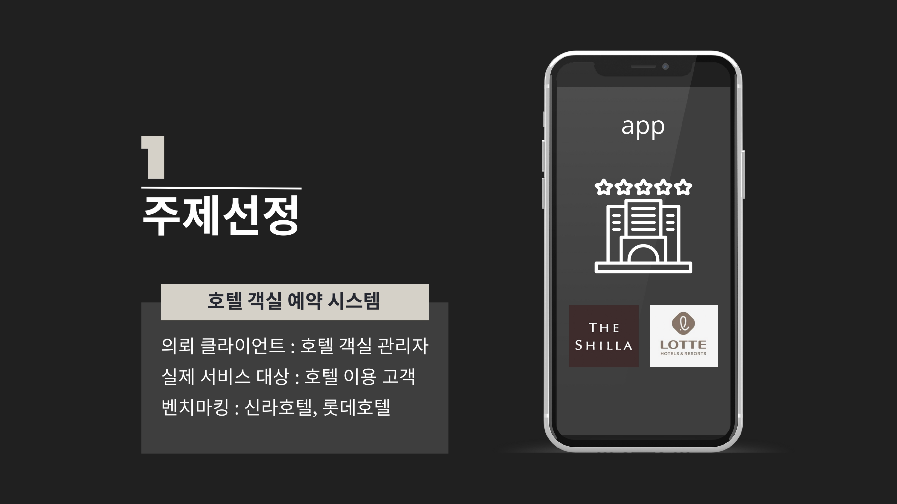
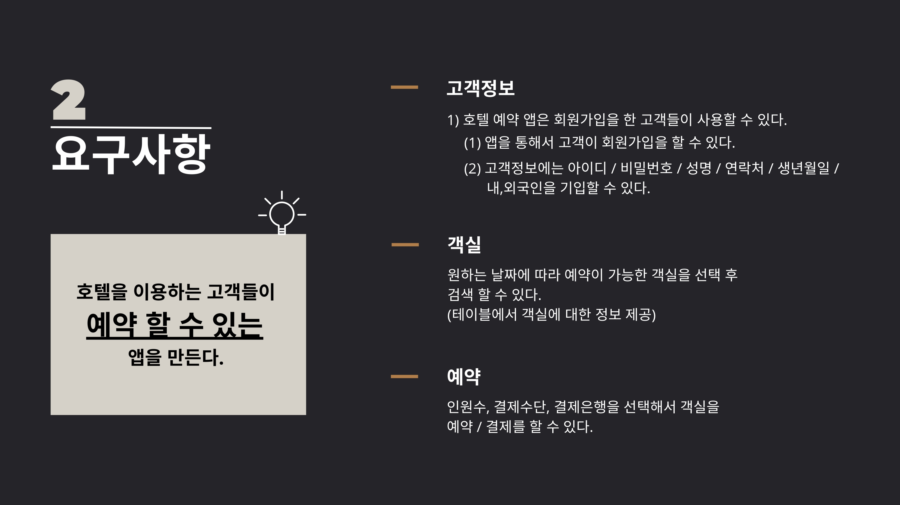
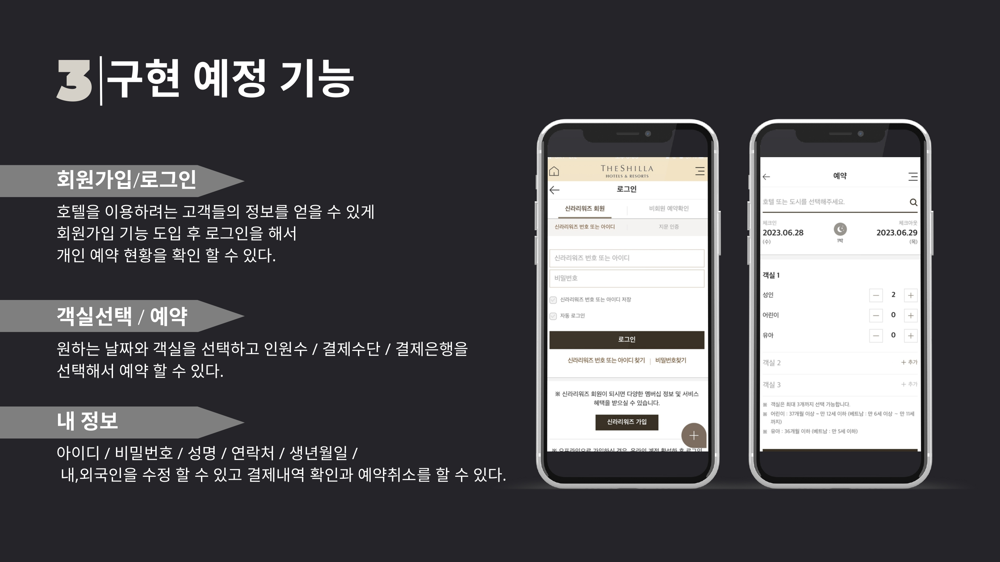
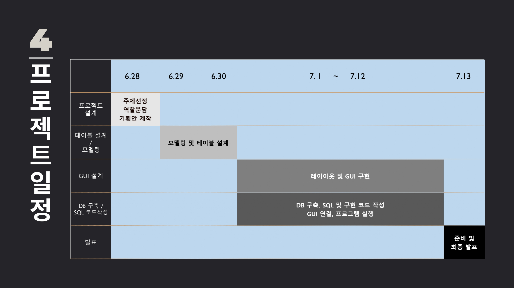
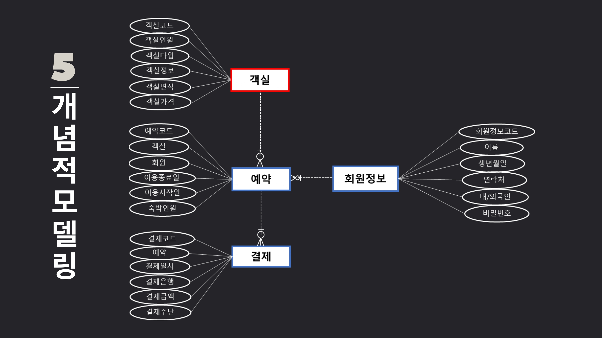
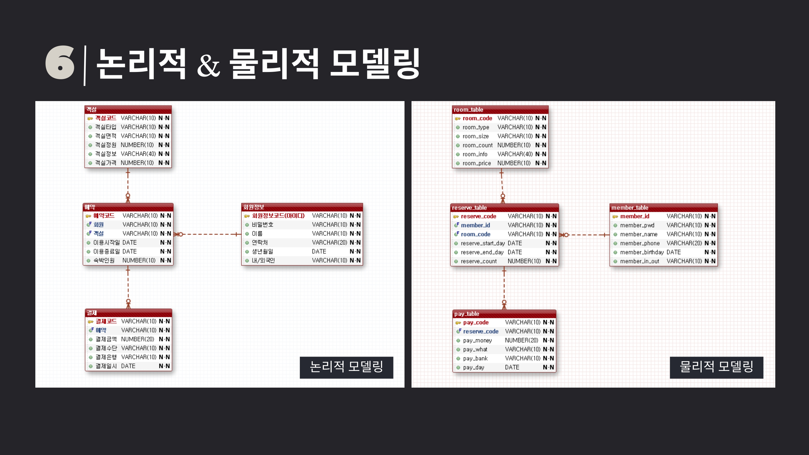
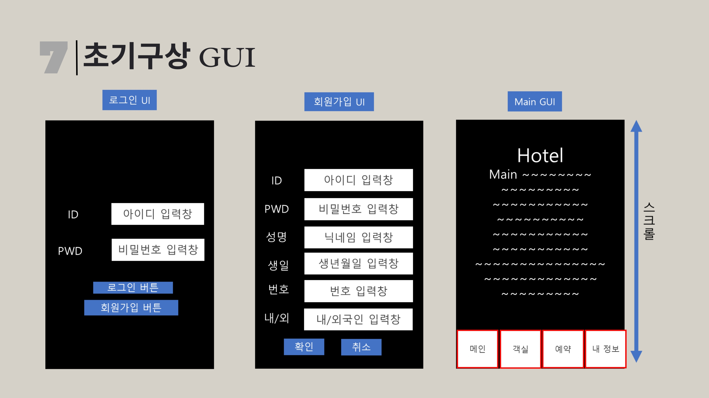
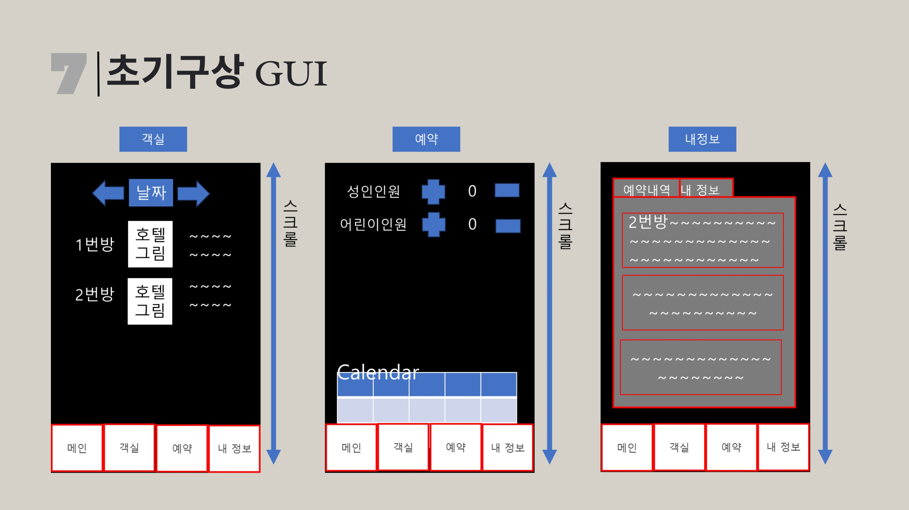
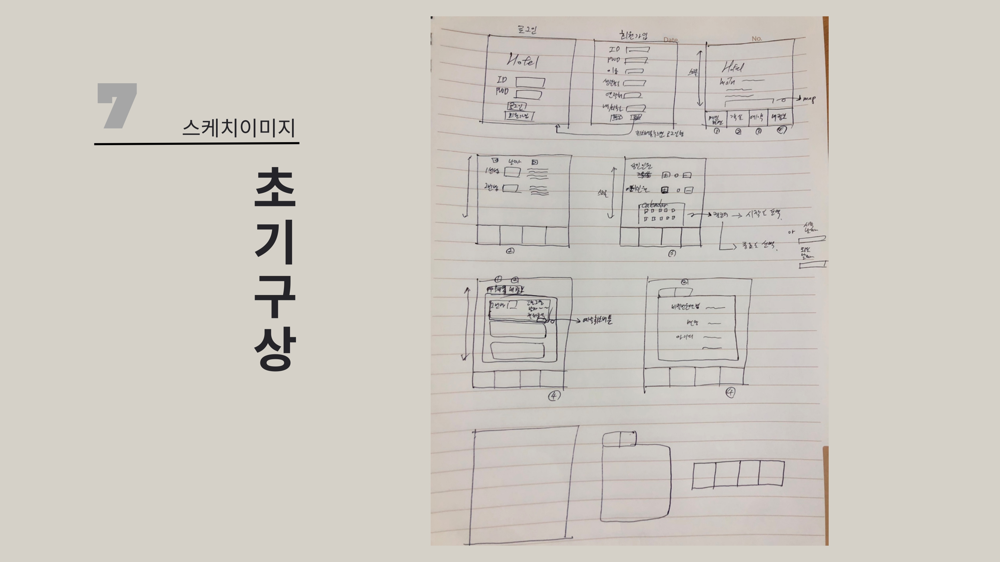
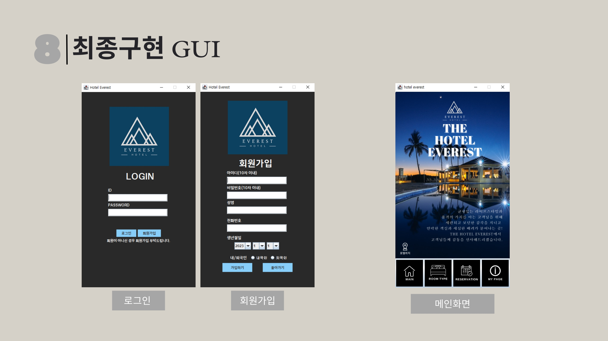
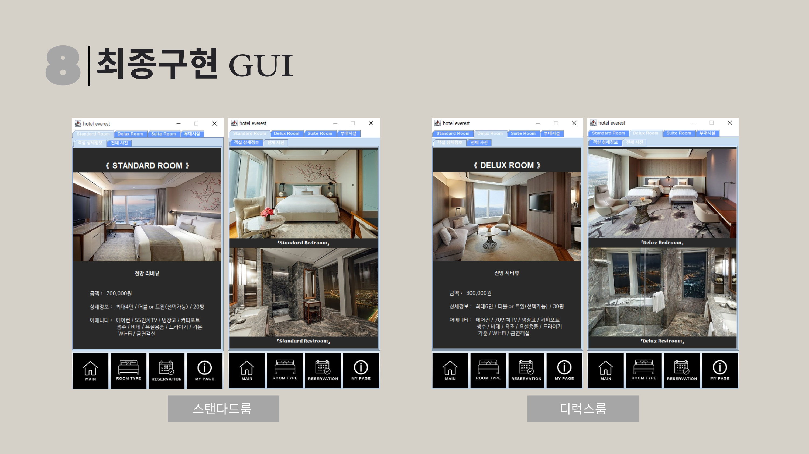
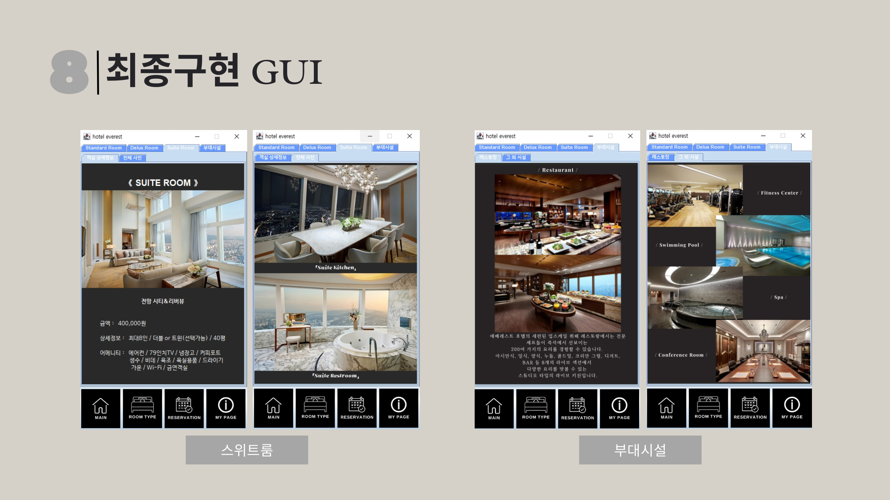
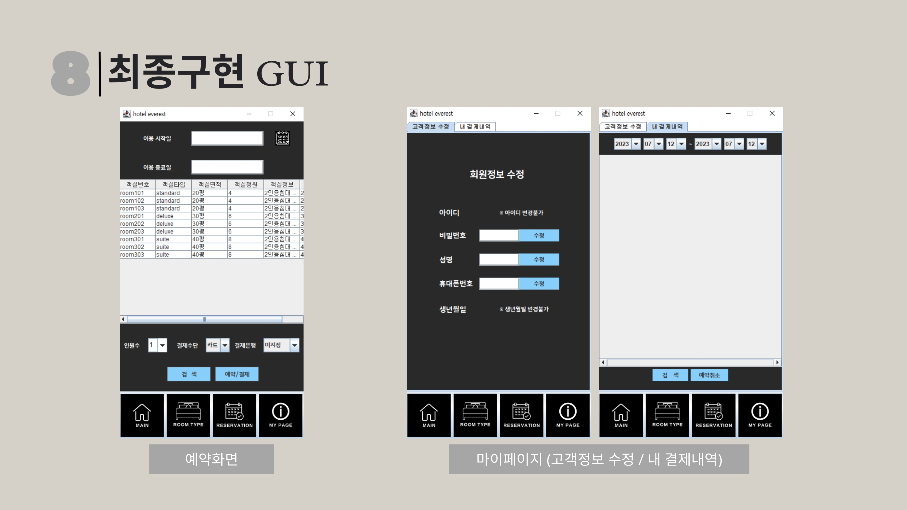
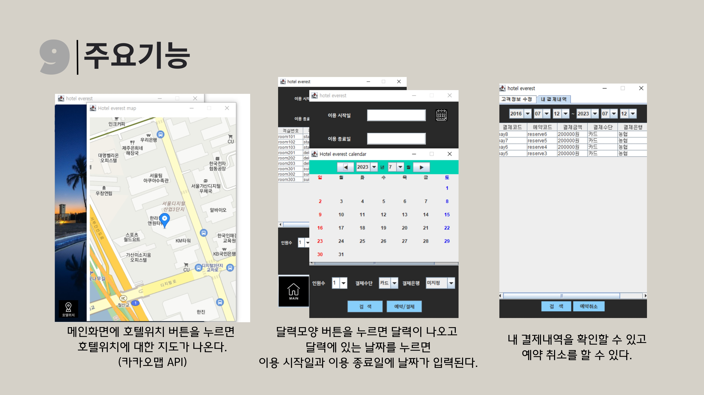

---

## 💡 깨달은 점
- 카카오맵을 사용하기 위한 웹 뷰 기능 부분은 Java Swing 대신 JavaFX로 대체해서 사용
- **Interface**를 작성해두면 협업시 용이하다. 동시 작업 가능
- **JDBC**를 이용하여 Java와 Oracle DB를 연결, 관리하기
- **JAVA** 활용 능력 향상
- **SQL**문 작성 능력 향상
